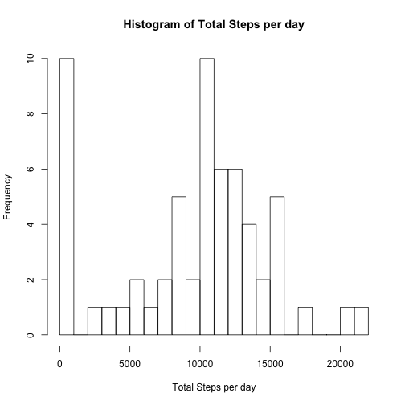
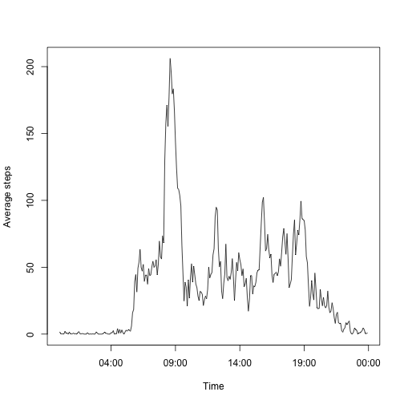
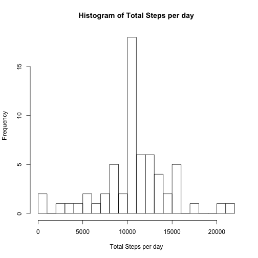
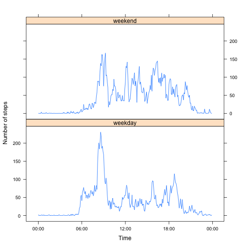

## Loading and preprocessing the data


```r
#load the data from activity.csv from working directory
activityData <- read.csv("activity.csv", na.strings=c("NA"), header=TRUE)
#convert date column to Date type (instead of character)
activityData$date <- as.Date(activityData$date)
#define a function to convert the interval field to a more familiar HH:MM format
#this is from a suggestion by Jerry Kurata on https://class.coursera.org/repdata-012/forum/thread?thread_id=36
intToHHMM <- function (i) {  sprintf("%02d:%02d", i %/% 100, i %% 100)}
#add a new column with the 24hr time of the measurement, convert it to a factor
activityData$time <-  intToHHMM(activityData$interval)
activityData$time <- factor(activityData$time)
#for completeness, add another column that combines the date and time fields into a POSIX date time object
activityData$dateTime <- strptime(paste(activityData$date, activityData$time), format="%Y-%m-%d %H:%M")
```

## What is mean total number of steps taken per day?

```r
totalSteps <- aggregate(activityData["steps"], by=activityData["date"], FUN=sum, na.rm=TRUE)
hist(totalSteps$steps, breaks=20, xlab="Total Steps per day", main="Histogram of Total Steps per day")
```

 

```r
mean(totalSteps$steps)
```

```
## [1] 9354.23
```

```r
median(totalSteps$steps)
```

```
## [1] 10395
```


## What is the average daily activity pattern?


```r
dailyPattern <- aggregate(activityData["steps"], by=activityData["time"], FUN=mean, na.rm=TRUE)
colnames(dailyPattern)[2] <- "averageSteps"

plot(x=strptime(dailyPattern$time, format="%H:%M"),y=dailyPattern$averageSteps, type='l', xlab="Time", ylab="Average steps")
```

 

```r
#index of time interval with maximum steps
index <- which.max(dailyPattern$averageSteps)
#time of maximum steps
#maxTime <- strptime(dailyPattern[index,1], format="%H:%M")
maxTime <- dailyPattern[index,1]
sprintf("The 5 minute interval with the highest average number of steps is at %s", strftime(strptime( maxTime,format="%H:%M"), format="%H:%M %p"))
```

```
## [1] "The 5 minute interval with the highest average number of steps is at 08:35 AM"
```


## Inputing missing values

```r
#find the total number of missing values
numMissing <- sum(is.na(activityData$steps))
sprintf('There are %s missing values.', numMissing)
```

```
## [1] "There are 2304 missing values."
```

```r
#merge average number of steps by interval into activityData
activityData <- merge(activityData, dailyPattern, by="time")
#sort activityData so the rows are in chronological order
activityData<-activityData[order(activityData$date),]
#if the steps value is NA, replace it with the interval average (in column 'averageSteps')
activityData$steps[is.na(activityData$steps)] <- activityData$averageSteps[is.na(activityData$steps)]

totalStepsFilled <- aggregate(activityData["steps"], by=activityData["date"], FUN=sum, na.rm=TRUE)
hist(totalStepsFilled$steps, breaks=20, xlab="Total Steps per day", main="Histogram of Total Steps per day")
```

 

```r
meanSteps<-mean(totalStepsFilled$steps)
medianSteps<-median(totalStepsFilled$steps)
meanSteps
```

```
## [1] 10766.19
```

```r
medianSteps
```

```
## [1] 10766.19
```

```r
sprintf("After filling in missing values with inteval averages, the mean number of steps per day is %.1f and the median is %.1f", meanSteps, medianSteps)
```

```
## [1] "After filling in missing values with inteval averages, the mean number of steps per day is 10766.2 and the median is 10766.2"
```


## Are there differences in activity patterns between weekdays and weekends?

```r
#define weekend day classes
weekendDays = c('Saturday', 'Sunday')
#initialize dayType column, first by giving every day the weekend label
activityData$dayType <- 'weekday'
#if the weekday matches the weekend day pattern, give it the weekend label
activityData$dayType[weekdays(activityData$date) %in% weekendDays] <- 'weekend'

dailyPattern2<-aggregate(list(aveSteps=activityData$steps), by=list(time=activityData$time,dayType=activityData$dayType),FUN=mean)
library(lattice)
xyplot(dailyPattern2$aveSteps ~ as.POSIXct(strptime(dailyPattern2$time, format="%H:%M")) | dailyPattern2$dayType, 
       layout=c(1,2), type='l', xlab='Time', ylab="Number of steps",
       scales=list(format="%H:%M"))
```

 
